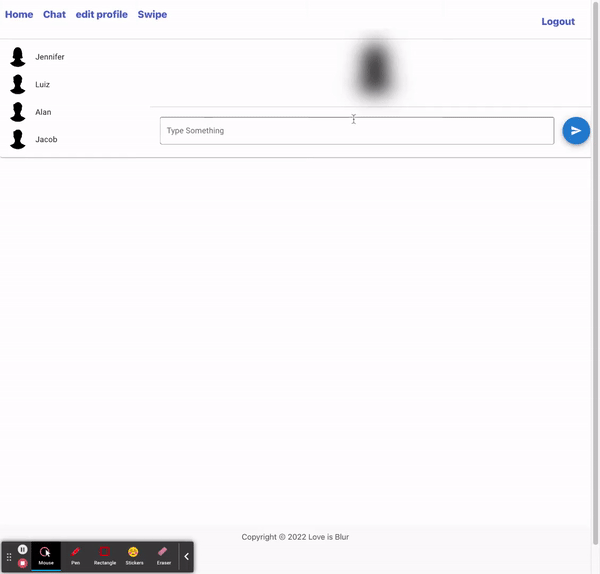

## Description

Our dating app is all about prioritizing values over looks. Instead of basing decisions on appearances, our app encourages users to get to know each other on a deeper level. This is made possible by not allowing users to see each other's photos until they match and send messages for a bit. Pictures start blurred and gradually unblur, hence our name Love is Blur. Our app is built using React, GraphQL, Apollo, material-UI, Bulma and Mongoose among others. These technologies allow us to create a unique and user-friendly experience. Whether you're looking for a long-term relationship or just looking to meet new people, give our app a try and see the difference for yourself!

[Click here for a link to the deployed app!](https://love-is-blur.herokuapp.com/)

## Table of Contents

- [Description](#Description)
- [Usage](#Usage)
- [Features](#Features)
- [Code-Snippets](#Code-Snippets)
- [Built-With](#Built-With)
- [Authors](#Authors)
- [Contributing-Guidlines](#Contributing-Guidlines)
- [Questions](#Questions)
- [License](#License)

## Usage

Make sure you have mongoDB and MongoDB Compass installed first. Next, to run our app on your local machine all you need to do is fork the repo, install the dependencies, run "npm run seed" and "npm run develop" in the root directory and it will start up the server and webpage.

## Features

### Homepage

The first thing you see is our homepage, with a few sections if you scroll down it you see the text effects. This was made with framer and react-moving-text.


### Sign Up

The first thing you need to do is sign up and upload a photo and name and bio about yourself. We use the cloudinary widget to upload photos for storage.heres a gif of what sign up looks like:


### Swipe

Next, you cant get to the swiping. Our swiping was somwhat based off of tinder and we use react-tinder-card npm pacakge to give it funtionality. If someone you liked, also likes you back, you will be notified.


### Chat

We have a chat page where all you matches will be located and where you can message them. Both your and your match's pictures will start blurred and will gradually unblur as you send messages.Here's what is looks like:


### Edit Profile

The edit profile page is wher eyou can upload a new image and update your bio and name.


## Code Snippets

An interesting snippet is where we upload the Cloudinary widget so we can upload photos:

```
const myWidget = window.cloudinary.createUploadWidget(
  {
    cloudName: process.env.cloudName,
    uploadPreset: process.env.uploadPreset,
    cropping: true,
    multiple: false,
  },
  (error, result) => {
    if (!error && result && result.event === "success") {
      console.log("Done! Here is the image info: ", result.info);
      // const urlString = result.info.url
      imgURL.current = result.info.url;
      console.log(result.info.url);
      console.log(imgURL.current);
    }
  }
);
//function to open the cloudinary widget
const openWidget = (myWidget) => {
  // event.preventDefault();
  myWidget.open();
};
```

Here's another interesting code snippet. This is our logic for gradually unblurring the profile pictures as the users send messages to eachother:

```

    //blur logic
    const Style = {
        blur: {   //if messages are less than or == 10,  blur incremently, otherwise no blur
            filter: `blur(${messages.length <= 10 ? 20 - (messages.length * 2) : 0}px)`
        }
    }

```

## Built With

- 
- 
- 
- 
- 
- 
- 
- 
- 
- 
- 
- 
- 
- 
- 
- 

## Authors

**Chris Gibson**

- [GitHub](https://github.com/chrischarlesgibson)
- [Linkedin](https://www.linkedin.com/in/chris-gibson-415909250/)

**Luiz Borges**

[](https://github.com/luizborges146)
[](https://www.linkedin.com/in/luiz-borges-2377b7142/)

**Mari Ma**

[](https://github.com/DraconMarius)
[](https://www.linkedin.com/in/mari-ma-70771585/)

[Icon credit @ Anton Kalashnyk](https://icon-icons.com/users/14quJ7FM9cYdQZHidnZoM/icon-sets/)

**Jacob Caloca**

- [GitHub](https://github.com/JCaloca)
- [Linkedin](https://www.linkedin.com/in/jacob-caloca-003479a1/)

## Contributing Guidlines

If you would like to contribute to this app, please create an issue and we can discuss further.

## Questions

For any questions, please reach out by creating an issue.

## License

Licensed under the MIT license.[License details here](https://opensource.org/licenses/MIT)
